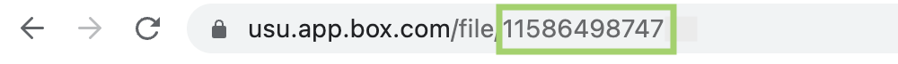

# Monday QA Board Automation Project
Center for Instructional Design and Innovation - Utah State University
* Created by Emma Lynn (a02391851@usu.edu)
* Supervised by Neal Legler, CIDI Director (neal.legler@usu.edu)
* On request from Neal Legler, CIDI Director & Christopher Phillips, Electronic & Information Technology Accessibility Coordinator

This repository contains code connected to a webhook on Monday.com that will:
* Pull an institution's accessibility report from Blackboard's Ally API
* Combine the accessibility report with other data generated from an institution's Canvas
* Use that data to automatically update USU's QA board on monday.com

## Using the Tool
* Navigate to the QA board on Monday.com
* The first(? last? update this once we decide) row of the board will be titled `Automations`
* The `TidyUp URL` and `Report URL` columns have been repurposed in this row
  * `TidyUp URL` contains the Box file ID for the Institutional Ally Report
  * `Report URL` contains the Box file ID for the Institutional Course Summary Report
  * For most accurate results, update each of these IDs before beginning the update process
  * The file ID can be found in the URL of the corresponding file in Box:
  * 
* To trigger the webhook and begin the update, change the `Update entire board?` column
  * To fill in an empty board, completely from scratch, change `Update entire board?` to `Fill whole board`
  * To update an existing board with the most recent course information, change `Update entire board?` to `Update now`
* This action will trigger the webhook and the update process will begin
  * It may take some time to update all courses
  * When the update is complete, the `Update entire board?` column on the `Automations` row will change to `Updated`

### Notes:
* The board will not be updated if the webhook is trigger on any other row besides `Automations`

## Bug Reports
If something behaves unexpectedly, or you run into a problem with the program, please let me know.

Send bug reports to a02391851@usu.edu with the subject line "Bug Report - Monday QA Webhook".

Please include:
* What you expected to happen
* What actually happened
* The date and approximate time you triggered the webhook
* Any other information that you think could be useful

I will get back to you promptly with an update. Thank you.