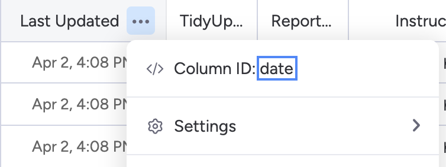

# Monday QA Board Update Tool
Center for Instructional Design and Innovation - Utah State University
* Originally created by Emma Lynn (e.lynn@usu.edu)
* Continuous Development by Emma Lynn and Dheeraj Kotte (d.kotte@usu.edu)
* Maintained by Emma Lynn and Dheeraj Kotte
* Supervised by Neal Legler, CIDI Director (neal.legler@usu.edu)
* On request from Neal Legler, CIDI Director & Christopher Phillips, Electronic & Information Technology Accessibility Coordinator

This repository contains code that will:
* Pull an institution's accessibility report from Blackboard's Ally API
* Pull additional Canvas data from USU's data lake
* Combine the two data sources
* Use that data to automatically update USU's QA board on monday.com

This tool is currently hosted at: TODO

Active version: **3.0.0**

## Usage
* Navigate to TODO.
* You'll see a list of the boards that are being actively updated (every night at TODO)
  * You'll also see a list of boards that are not currently running updates
* To trigger an update manually (outside of the automatic schedule), click the `Trigger Update Now` button for a board.
* To edit a board's information, click the `Edit` button in the upper right of the board's box.
  * Note that a board's Monday.com ID cannot be updated. To update a board with a different Monday ID, create a new one.
* To add a new board, click the `Add New Board` button in the upper right of the page.
  * To find the Monday.com ID, see [here](https://support.monday.com/hc/en-us/articles/360000225709-Board-item-column-and-automation-or-integration-ID-s).

  * The Last Updated Column ID is the column ID for the Last Updated column on the Monday board. This may change depending on the board, so you need to find it on Monday.
    * You may need to enable developer mode on Monday to be able to view column ids. See instructions [here](https://support.monday.com/hc/en-us/articles/360000225709-Board-item-column-and-automation-or-integration-ID-s).

  * If you don't already have the Ally Semester (or term) Code, reach out to Christopher Phillips (christopher.phillips@usu.edu).
  * A date when the automation will automatically become inactive is optional. All newly created boards are active.
* To view or manage maintainers, click the `Manage Maintainers` button in the upper left of the page.
  * Maintainers will receive emails about errors or issues with the application.
* To view issues or errors with updates, click the `View Errors / Issues` in the upper left of the page.
  * Critical errors are displayed in red. These are errors that caused the whole update to fail.
  * Non-critical issues are displayed in yellow. These are issues that may have caused certain rows on the board to fail to add/update, but did not cause the entire board's update to fail.

## Prepping a New QA Board
When a new QA Board has been created and needs to be populated with data, follow these steps to prep the board.
* Add the following automations to the board (if they do not already exist):

* If the column `Last Updated` does not already exist, add it to the end of the columns of the main board and hide them from the `QA View`.
* Follow the instructions above to Add a New Board.

## Change Log

### 3.0.0
* Complete UI overhaul
* Converted application to mainly act as a config setup for automatically running updates
* Backend converted from Python to Node.js
* Canvas data being pulled directly from university data lake
* Ally data being pulled directly from Ally API

### 2.0.1
* Adding replacement of 'Concurrent Enrollment' with 'Concurrent' to match monday board configuration

### 2.0.0
* Migrated monday.com API calls for version 2023-10 (BREAKING CHANGE after 01-2023)

### 1.1.2
* Bug fixes

### 1.1.1
* More responsive retrieval of Ally link
* Support for adding a new term
* More intuitive flow
* Support for running multiple updates at once
* Improved bug reports
* Better conformation to software development best practices
* Added reliance on database
* Better input validation

### 1.1.0
* Added support for larger terms like Fall & Spring
* Added a report courses that failed to add to the completion email
* Added immediate failure and response to client if board ID is not recognized
* Changed order of user flow to prevent Box Authentication timeouts
* Added a 404: Not Found page
* Added a condition to change rows with `College` listed as unsupported `Disability Resource Center` to `University`
* Changed the monday completion status from `Updated` to `Done` to conform better with the rest of the boards

### 1.0.0
* Initial release as web application

## Bug Reports
If something behaves unexpectedly, or you run into a problem with the program, please let me know.

Fill out a bug report [here](https://master.d3kepc58nvsh8n.amplifyapp.com/bug-report),
or follow the following steps:

Send bug reports to e.lynn@usu.edu with the subject line "Bug Report - Monday QA Update".

Please include:
* What you expected to happen
* What actually happened
* Right click the page where you encountered the issue and click `inspect`.
  Expand the window if necessary and click on `Console`. Please copy and paste the content of the window into your bug report.
* The date and approximate time you attempted to use the application
* Any other information that you think could be useful

I will get back to you promptly with an update. Thank you.