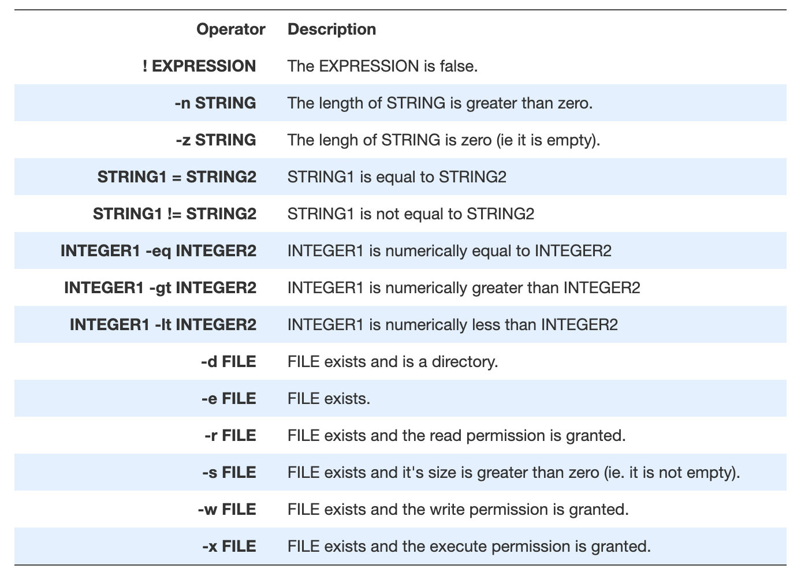
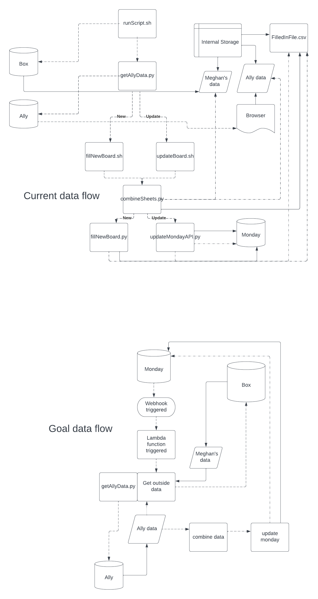
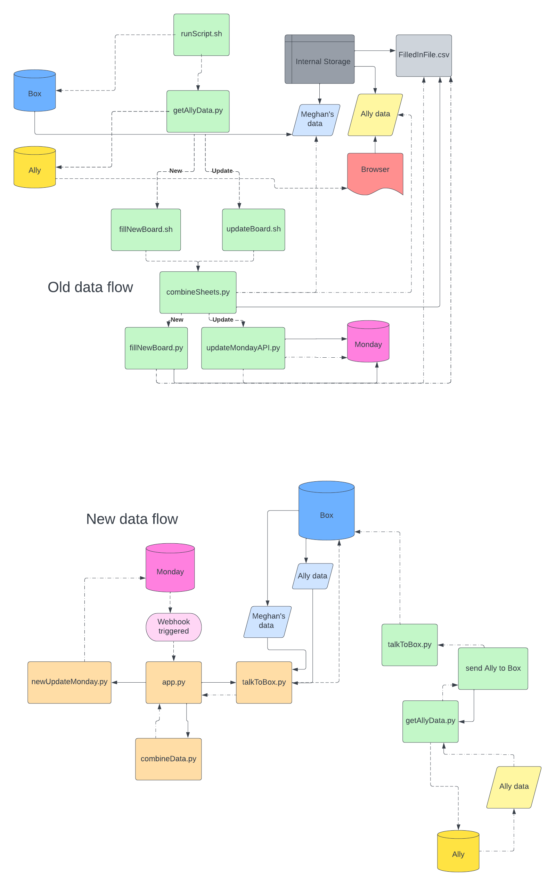

# Monday QA Board Automation Project
Center for Instructional Design and Innovation - Utah State University
* Created by Emma Lynn (a02391851@usu.edu)
* Supervised by Neal Legler, CIDI Director (neal.legler@usu.edu)
* On request from Neal Legler, CIDI Director & Christopher Phillips, Electronic & Information Technology Accessibility Coordinator


**_Documentation of progress on the project_**

## Project Goals
Automate updating the QA monday board from Meghan's data and the Ally accessibility report
### Objectives
1. Combine Meghan’s spreadsheet (Course Summary on Box) and the Ally report (from the Ally Institution Report on canvas -> export by term)
   * Format with the monday board headers
   * Meghan's data will have them, so just insert the Ally information
2. Given a monday board id, load the spreadsheet generated from step 1 into monday
   * Courses loaded into correct section of board based off enrollments
3. Create update process
   * Run steps one and two on a board already populated with data
   * Match and skip courses already on the board
   * Think about updating
     * If a course gets cross listed or changed some other way later, we don't know how we'd match to the old course
     * So we may run into duplication concerns
     * Possibly remedied in phase 4 - active data lake gives us information that allows us to match former and newly cross listed courses
4. Import everything straight from the data lake into monday
   * _Assumes that we have an active data lake_
   * ON HOLD
_Notes:_
   * Phases 2 & 3 could continue to be done manually if automating them would be too hard (hmm is that a challenge?? :/)
   * Phase 4 cannot be completed until the data lake is finished- on hold pending Meghan and her team

### Steps
#### Phase 1
* Maybe do a little research on combining .csv files
* Write the program
  * Figure out pulling Ally data from their API for just one term
* Create temporary usage documentation
* Share progress with team
* _Notes:_
  * Not anticipating this to be too difficult
    * Okay well so I wrote this before I knew we'd have to get the Ally data from their API so it is proving to be a bit more complicated than I was thinking, oops
* Phase 1 completed 12.15.22
#### Phase 2
* Changing this to keep using the import excel/csv tool, this phase will now be creating a spreadsheet that is formatted correctly for import to monday
#### Phase 3
* 
#### Phase 4
* ON HOLD


## Progress Report

### 12.2.2022
* Began researching the monday API
* Requested a demonstration of how the board is manually updated
* Requested access to a "practice" monday board
* Did research on the monday app development framework
* I'm not exactly sure what the best course of action to start this will be until I can meet with Neal and get some more clarification on exactly what I need to be doing. I will set up a meeting with him for clarification on the project requirements and then return to the project.

### 12.6.22
* Met with Neal and Jenn and went over the manual process of updating the monday board
* Meeting notes:
  * Pull data for columns up to images in use 
  * Download course summary – Meghan's 
  * Export template from monday board 
  * Remove logo and hyperlink 
  * Manually sort into groups of number of students 
  * Remove all QA rubric categories (after images in use but KEEP item id)
  * Look into Ally api?? Neal forwarded email 
  * Ally report – the one we downloaded from canvas - Neal slacked
1. Combine Meghan’s and the ally report 
   * With monday board headers 
   * Maybe we’ll get Meghan to get her output to match monday – yes write it like that
2. Given board id, script will load the data into monday
   * Manual option could be done if necessary 
   * Items go into group by number of students 
3. Create update process 
   * Doing steps one and two with match & update or skip 
   * Maybe just match and skip? Weird exceptions with updating 
   * If a course gets cross listed later and is all different idk how we’d match 
   * Hmmmmm
4. Generate a spreadsheet or JSON or something to import to monday from the data lake 
   * _Assumes that we have an active data lake_
   * ON HOLD
* Updated project documentation based off meeting
* Began working on phase 1 - read in .xlsx file

### 12.7.22
* Created mock up of program for small test data
* Moving on to the actual format
* Which Ally report will we be using? Can we get one with just the specified term or do we need to use the one with all the data for all time?
* Talked with Christopher about using the Ally API to get data from just one semester
    * I think this is the API call I want: `GET /api/v1/:clientId/reports/terms/:termId/csv`
    * Christopher is going to show me the other project that is using it, as well as helping me get authenticated
    
### 12.8.22
* Working on getting Ally data from their API
* Got search and match functionality working for the small test data
* Talked with Christopher about using OAth, maybe going to set up a meeting with Tyler for this afternoon
* Read over OAuth python library docs
* Tyler said he'd try to figure out the Ally API, I'm going to look at it as well and see if I can come up with my own jumping off point
* Looked at it a little more- I think mostly what I'm confused about it all the urls- the walkthrough of requests-outhlib from the documentation is talking about all sorts of URLS and idk which one is for what
  * Feeling kind of stuck - I might just wait and see what Tyler comes up with
* In the meantime, beginning to do research for step 2
* So it looks like there's not a specific API call that completes the import process from a .csv, we pay for a third party app
  * If I could have their code that would be great but that is not happening
  * So I'm thinking maybe I build our own monday app?? That is compatible with the import script I'm writing
  * Although that might be a lot a lot of work just to eliminate like literally just selecting a file to upload... so maybe it's not worth it... or it could be something that gets worked on slowly over time and is an eventual goal
* Looked at the monday app SDK, built a little hello world app

### 12.9.22
* Continued looking at OAuth requests, figured out how to make the API call to get the Ally data!!!
* Added dotenv dependencies for secure information
* Talked through a new plan with Neal:
    * Merge Meghan’s Course Report CSV and the Ally report. Since we’ll fiddle with so many CSVs, we can give them fancy sounding names for shorthand. I’ll call the result of this the Merged Active Course Report (MACR).
    * Get a clean CSV with the existing names, course URLs (which will have the course ID) and the item IDs out of Monday.com. I’ll call it the Monday Item Match File (MIMF).
    * Match, to the extent possible, the courses in the MACR with the corresponding items in the MIMF to get the Monday item IDs for the courses we have already added to our board. Add the item IDs to the MACR to get the Importable Merged Active Course Report (IMACR).
    * Then we can manually load the IMACR into the Monday board using the Update With CSV tool.
* Script written to download ally data and move to current project directory
    * We can't have the command to download the zip and the commands to manipulate the zip file in the same shell script- it moves too fast and the zip isn't ready by the time the shell script is finished
    * Current commands to run:
      * `$ python3 getAllyData.py`
      * `$ bash generateFile.sh`
* Next steps: figure out what format Meghan's data is going to be in, begin writing merge process
    * I'm guessing we'll need two or three merges depending on if Meghan's data is formatted correctly already:
        * Merge Meghan's data in with a blank sheet with monday headers (If it is not already done)
        * Merge the Ally report with Meghan's report
        * Download the current monday board, merge in with existing data (get monday item ids)
    * To download the current monday board I'll need to figure out the monday API

### 12.13.22
* Talked with Meghan, she's going to try to get her data formatted correctly and sent over tomorrow
* Found descriptions of where information in the final report comes from in the monday heading sources key (linked in sources below)

### 12.14.22
* Meghan sent over her new data and it looks great!
    * Merge 0 can be skipped
* Started figuring out merge 1: running into `Incompatible indexer with Series` error- hmm....

### 12.15.22
* Continued working on merge 1
    * Resolved `Incompatible indexer with Series` error
    * Files are being combined successfully, removed several extra unnecessary searches
    * Tested with full data, works great!
* Fixed a problem with the Ally report pending
* Connected the merge process with the process to get the Ally data
* Shell script is being weird - figure that out later
    * Program is ran with:
        * `$ python3 getAllyData.py`
        * `$ python3 combineSheets.py`
* Merge 1 complete, moving on to merge 2 - pausing for a minute to work on other project
* Phase 1 complete

### 12.16.22
* Time stamp for ally report - add to the end of url: `&token=2022-12-16-8-18`
* Began working on merge with monday template
    * For each line in the FilledInFile, add to the correct list by number of students (100+, 50-99, 20-49, 10-19, 1-9, None)
    * Grab monday header rows, insert at top of each section
* Merge almost complete, just need to clean up I think

### 12.19.22
* Program is ran with:
  * `$ python3 getAllyData.py`
  * `$ python3 combineSheets.py`
  * `$ python3 mergeWithMonday.py`
* Cleaned up mergeWithMonday and tested with whole data
* getAllyData's not working?? I'm wondering is it because I'm not on USU's network? So the API call fails? But also idk hmm
  * Maybe try setting up the VPN later to see if that helps
* mergeWithMonday is basically done, I need to do more testing possibly, make it so bad data just gets skipped and doesn't crash the program
* Tested an import to monday, went fairly smoothly
  * Problems with `"Humanities Arts & Social Scie"`, `Agriculture & Applied Sciences`, I guess maybe all the things I changed? Check that

### 12.20.22
* Wrote shell script that will install all the dependencies
* Wrote usage documentation
* Updated performance report
* Figured out commas in data - mostly...
  * Quotation marks have to stay
* Added time stamp to Ally API call

### 12.26.22
* Fixed `Humanities, Arts & Social Scie`'s comma not getting merged back in
  * `Humanities, Arts & Social Scie` is a college not a department, in column 6 not 7 smh
* Figured out clean up- running more than once
* Tried to see if the USU VPN would fix getAllyData's authentication problem - did not seem to help at all :(
* Started drafting something asking what I should do about the absolute path thing
* Added license as prep for moving to public repo

### 12.29.22
* Asked Neal about how streamlined the process should be, absolute paths and stuff
* Got Hayden to try running the getAllyData file on USU's network to see if that's really the problem
  * Apparently he's getting the same error as me... so it's not the network hmm :/
* Asked Neal about licenses, he says the GNU GPL works just fine
* Updated license for 2023
* Added more robust exception handling
* Figuring out what's going on with missing values in the `FilledInFile`? (Overall Ally, Files Ally, WYSIWYG Ally)
  * Not a problem, no Ally data available- probably mostly from testing with the less recently updated Ally data
* Began working on phase 3 tasks since there's nothing left I can do on phase 2 until I'm back in the office
* Started working on script to match courses in an existing monday board - update process
  * Merge with existing board in progress
    
### 1.3.23
* Back in the office, problems with `getAllyData` resolved
    * Authentication was copied down wrong
* Figured out getAllyData's issues - updated README
  * Checked my authentication
  * VPN did not seem to help - but the VPN could just have network restrictions
  * Not a network problem
* Tested the whole process - phase 2
* Cleaned up and moved to public repository
* Continuing with phase 3
* Merge just about finished I think
    * Testing with monday import but it's taking a really long time ?? :(
* Added to report
* Researched options to download the current board with the monday API
* Finished set up for everything in phase 3 besides getting the current board from the monday API
    * Pushed to public repo
    
### 1.4.23
* Worked with a script I found that will download a monday board as a csv, not sure if it's gonna pan out
    * I maybe should just write my own
* Sooo I've realized that I've been doing about this the wrong way..
    * I've been trying to follow the manual update process which has been really holding the project back :/
    * I should change it so that I'm just doing the update using the API

### 1.5.22
* Kept working on using the monday API
```commandline
def slowCreateNewItem(itemName):
    newItemQuery = f'mutation{{ create_item(board_id: {BOARD_ID}, item_name: "{itemName}") {{ id name }} }}'
    data = {'query': newItemQuery}

    r = requests.post(url=apiUrl, json=data, headers=headers)

    jsonObj = json.loads(r.content)
    jsonPretty = json.dumps(jsonObj, indent=2)

    print(jsonPretty)

    return jsonObj["data"]["create_item"]["id"]

def slowUpdateRow(itemID, rowInfo):
    index = 0
    for col in COL_IDS:
        index += 1
        updateItemQuery = f'mutation{{ change_simple_column_value (board_id: {BOARD_ID}, item_id: {itemID}, ' \
                          f'column_id: {col}, value: "{rowInfo[index]}") {{ name id }}}}'
        data = {'query': updateItemQuery}

        r = requests.post(url=apiUrl, json=data, headers=headers)
```
* It's working great, I've got it mostly figured out now except for the groups which I'm looking at now
* Okay I think it's done, haven't really tested it but we're in a super great place

### 1.6.23
* Testing the new script
* Ran into JSON error - probably should add some try-except blocks for some of the API calls
* Fixed a problem with moving rows to the correct group where the original number of students is not recorded until after the data is updated
* Added to report in updateMondayAPI.py
* Added exception handling
* Updated docs
* Tested with a full FilledInFile - success!! Took a while though... 
* Figured out Study Abroad delivery methods

### 1.9.23
* Tested the whole update process
* Pushed changes to public repo
    * Changes:
        * `generateUpdateFile.sh`
        * `progress.md`
        * `README.md`
        * Delete `mergeExistingBoard.py` and replace with `updateMondayAPI.py`
* Added `fillNewBoard.py` on branch `fix-intial-upload`

### 1.10.23
* Changed populating an empty board to use the new method
  * Updated docs again
  * Pushed to `main` branch
* Tried to see if I can improve runtime
    * Worked on trying to limit the number of repeat courses that show up in the `FilledInFile`
* Demonstrated usage to Neal and Jenn, helped Jenn with set up
    * Edited docs to prompt users to download Python
    
### 2.6.23
* Talked with Christopher about automating the rest of the process (particularly getting Meghan's file)
    * We could standardize the file structure to allow a script to work
* Played around with writing some Bash scripts
    * Found this: https://ryanstutorials.net/bash-scripting-tutorial/
    
### 2.7.23
* Notes from Bash tutorial:
    * $ is placed before any variable to be read
    * $1, $2, $3, etc are the arguments (up to $9)
    * $0 is the name of the bash script
    * $# is the number of arguments
    * $@ is all the arguments
    * $? is the exit code for the most recently run process
    * $$ is the process ID of the current script
    * $USER is the username of the user running the script
    * $SECONDS is the number of seconds since the script started
    * $RANDOM returns a random number
    * $LINENO returns the line number in the script
    * Run env to see other variables you can use
    * Declare variable: variable=value
        * No space on either side of =!!
    * Put quotes around things with spaces
    * Command substitution: myvar=$( ls /dirName | wc -l ) 
        * Then use as variable
        * If output is several lines, /ns are removed
    * To pass a variable to another process, export it:
        * export var1
        * ./script2.sh
        * (Now script2 will run and have access to var1)
        * One way process - any changes made in new process will not affect first process
    * Ask user for input: read var1
        * Arguments: -p allows you to specify a prompt, -s makes input silent
        * Splits on whitespace
    * Pass variables in from other processes:
        * ```
             #!/bin/bash
             # A basic summary of my sales report
             echo Here is a summary of the sales data:
             echo ====================================
             echo
             cat /dev/stdin | cut -d' ' -f 2,3 | sort
        * Run with: $ cat salesdata.txt | ./scriptName
    * Ways to get input: command line arguments, read input during script duration, accept data redircted to script from STDIN
        * Favor command line arguments when possible
    * let is a builtin function of Bash that allows simple arithmetic
        * let "a = $1 + 30"
        * echo $a
    * expr is similar except prints the result automatically and doesn't need quotes
        * expr 5 + 4
        * Save result: a=$( expr 10 - 3 )
    * For multiplication: /*
    * Or we can do arithmetic with $(( expression ))
    * Length of variable: ${#var}
    * ```
       if [ <some test> ]
       then
         <commands>
       elif [ <some test> ]
       then
         <different commands>
       else
         <other commands>
       fi
    * Example command: $1 -gt 100
    * [] references the command test
        * Operators included in test: run $ man test



* if [ -r $1 ] && [ -s $1 ] <- and
 * if [ $USER == 'bob' ] || [ $USER == 'andy' ] <- or
* Cases are also a thing
* While loops:

        while [ <some test> ]
        do
            <commands>
        done
        ```
* You can also replace while with until for like the opposite of a while loop
* For loop:

        for var in <list>
        do
            <commands>
        done 
* Can be done in ranges: {1..5} (NO SPACES!)
    * {startValue..endValue..increment}
* Can go through a file by putting the file name / path
* Break and continue used normally
* Select is a simple menu system:

        select var in <list>
        do
            <commands>
        done
* Functions:
  
        function_name () {
            <commands>
        }
* () never has anything in it - decor
* No return values - just return status
    * 0 means everything's good
* A work around is use command sub and have the function print the result (and only that)
* By default vars are global
    * Create local var by add local in front of varName
* You can override already existing commands
* tPut: https://ryanstutorials.net/bash-scripting-tutorial/bash-user-interface.php

* Created new branch `complete-automation` to work on creating a more complete automation
* Began writing a script to automate the rest of the process
* Started building standard file structure

### 2.8.23
* Tested the whole process for -new and -update
* Remembered to remove the filenames.txt file
* Tested the whole process and everything seemed to go smoothly
* Decided not to remove specifying Meghan's file name in .env so there's still a manual option that doesn't use the required file structure
* Wrote a script to confirm that Box is set up correctly and the required file set up is in place
* Asked Christopher about if the Box file structure is always the same - seems like it is
* Wrote documentation for using the new automation

### 2.23.23
* Added prettier file structure diagram to README
* Showed Jenn the new, more complete automation
  * It got stuck on moving the Ally file into the project directory
    * It may be because she had a bunch of other ally*.zip files in her downloads?
    * Could also be because her Box set up is different
    * Tested it on my computer and it seems to work fine
      * Idk why it lists everything in the Download folder tho, that's kinda weird
    * We troubleshot a little more and it seems like the problem might have been the duplicate ally*.zip=
  * There also seems to be a csv parsing error with a new department: `Technology, Design & Technical`
* Fixed `Technology, Design & Technical` problem
* Added note to remove all ally*.zip files from downloads to docs

### 2.24.23
* Substituted `Study Abroad` with `Supervised` and `Disability Resource Center` with `CPD`

### 3.3.23
* Organized references
* Started looking at maybe converting this project to a webhook/AWS lambda

### 3.14.23
* Issues with moving to webhook/serverless
  * Reliance on csvs/file system
  * Pulling from Meghan's data - Box file
  * Ally file downloads as a zip
* Created map of data flow for better visualization of what I need to do



### 3.15.23
* Connected to monday with webhook
* Started looking at alternate ways to use the Ally API

### 3.16.23
* Kept trying to think of ways to get the Ally data
  * Asked Ludo if he has ideas
  * Maybe if there's really not a great way to do this but I can get it working with Box it could be something that we do separately periodically and update in Box?
* Started looking at getting course report from Box
* Was successfully able to access an Excel file from Box and read into a dataframe!!
* Tested with the actual course file and it works!!
  * Should be super easy to use since I originally read the excel file into a dataframe so it should work the same
* (Using test1 auth for box)

### 3.17.23
* Found some more Ally resources from Anthology
* Successfully created JWT token and made successful curl request
* JWT creation:
  * Headers: ```{
  "alg": "HS256",
  "typ": "JWT"
}```
  * Payload: ```{
 "iat": 1679061600,
 "exp": 1710684000,
 "roles": "urn:lti:role:ims/lis/Administrator",
 "custom_canvas_course_id": "519",
 "custom_canvas_user_id": "CLIENT_ID",
 "launch_presentation_locale": "en",
 "launch_presentation_return_url": "https://ally.instructure.com"
}```
* Was able to access the Ally API but now that I understand it a little more I don't think it has the endpoints I need :(
  * So we'll probably have to go with the contingency plan - write a script that will send the Ally data to box
* Set up sending the Ally file to Box as well as retrieving it
* Refactored combineData.py and converted to take in two dataframes instead of two files


### 3.20.23
* Ludo sent me an example of his use of the Ally API converted to NodeJS- it works for one file at a time, and doesn't look like it's possible to get for the whole institution, there doesn't seem to be an endpoint for that
  * Plan B it is then
* Dataframe headers:
```angular2html
Course
URL
TidyUp URL
Report URL
Instructor Names
Email (Inst)
College
Department
Delivery Method
Students
Overall in Use Ratio
Files
Files in Use
Files in Use Ratio
WYSIWYG
WYSIWYG in Use
Videos
Kaltura
YouTube
Flash
Broken Links
Nav Items
Files Nav
Overall Ally
Files Ally
WYSIWYG Ally
PDF
PDF in Use Ratio
PDF no OCR
Images
Images no Alt
Images in Use
```
* Worked on converting the monday update code to read from a dataframe instead of a file
* Finished conversion to use dataframe


### 3.21.23
* Split filling new board and updating existing board into separate functions
* Connected everything to `app.py`
* Created monday automations to take care of changing the group based on number of students
  * Removed functionality from code
  * Should speed things up quite a bit
* Reorganized repo
* Wrote up some basic usage instructions
* Updated data flow visualization
  * 
* Added update for the trigger row
* Showed Jenn what I've been doing
* Added error handling if webhook is triggered on row other than `Automations`

### 3.22.23
* Looked at the other ways I could possibly authenticate Box
  * Everything else only uses a Service Account or needs admin access - so that's less than ideal
  * It's looking like we might have to keep doing it this way, possibly by reading in the access code from Monday
  * Which is annoying but idk what else we can do
* I'm wondering if it would maybe be better to do this as a simple, external web app? Instead of trying to make the webhook work?
  * Cause then we could use the regular OAuth2 flow for Box
* Maybe convert to Django app?

### 3.23.23
* Working on running process in background
* Created progress bar and user interface
* Working on OAuth flow for Box

### 3.24.23
* Kept trying to figure out Box auth
* Created isolated application for that

### 3.27.23
* Was able to successfully authorize Box in simple application
* Successful retrieval of data through complete mock data flow
* It works!!!
* Added csrf verification

### 3.28.23
* Tried to figure out a way to kill the process
* Mostly finished with creating the GUI

### 3.29.23
* Added support for downloading the ally link
* Added support to upload the courses.csv file
* Cleaned up UI some

### 3.30.23
* Finished cleaning up UI
* Error handling in Box Authorization
* Error handling getting Ally download link
* Error handling uploading Ally file
* Error handling missing arguments
* Error handling missing uploaded file

### 3.31.23
* Input validation
* Exception handling in update process
* Exception handling when given incorrect courses.csv file
* Exception handling for CSRF verification failure
* Looked into Unchecked runtime.lastError
  * Seems like it's more of a Chrome issue with my browser extensions and is fine
* Worked on getting the bug report page up and running

### 4.3.23
* Finished bug report form
* Asked Neal about adding group change automations to the main board
* Updated README.md
* Created new branch allowing script to be ran the old way
* Cleaned up git repo
* Created new branch for AWS deployment
* Started working on deployment - created initial deployment package

### 4.4.23
* Working on deployment - setting up serverless
* HTML content is being served, static is still giving a 404
* Did a little bit of looking into possibly other ways to host? Maybe AWS lambda is not the bestest for this idk man

### 4.5.23
* Looked into other hosting alternatives
  * Firebase
    * Ran by google
    * When limits exceeded, site disabled
    * Functions can only be written in JavaScript and TypeScript?
      * Or is that just for serverless functions?
  * Vercel
    * Must be non-commercial - won't work then
  * Netlify
    * Only 100 form submissions a month - not ideal...
  * Render
  * AWS Elastic Beanstalk
* Asked Neal and Christopher if they have thoughts about what would be the best way to do this
  * Neal's going to message Tyler to see if he has thoughts
  * Hosting option on elearn?
* Fixed .gitignore to ignore sample/testing data

### 4.6.23
* Refactored `app.py` for better organization
* Added honeypots to the forms
* Added some basic local authorization requirements
* Started looking into PythonAnywhere, playing with their deployment options
  * It looks like they won't give me enough CPU time so that kind of throws them out
* Testing full update
  * Seems like it's working good!!

### 4.12.23
* Started adding in better/cleaner authentication

### 4.13.23
* Removed internal authorization supply
* Started using session information - fixed login bug
* Removed most of the reliance on globals and replaced with session info - which will be more secure anyway
* Fixed putting in correct group when new row is created problem
* Now actually ready to move onto AWS if that will work

### 4.14.23
* Started working through AWS's `wild-rydes` tutorial
  * https://www.youtube.com/watch?v=GPme1i1VyQQ
  * https://webapp.serverlessworkshops.io/usermanagement/recap/
  * https://aws.amazon.com/getting-started/hands-on/build-serverless-web-app-lambda-apigateway-s3-dynamodb-cognito/module-1/
  * https://aws.amazon.com/getting-started/hands-on/build-serverless-web-app-lambda-apigateway-s3-dynamodb-cognito/

### 4.17.23
* Finished WildRydes tutorial
* Started trying to follow again for my application
  * ... I really wish I had just done all of this is js/node :/

### 4.18.23
* Continuing to work on deployment

### 4.19.23
* Populated board with Summer courses - I'm going to do it this time instead of Jenn since I've been messing with stuff

### 4.27.23
* I've decided to pivot my efforts
  * The backend for this application can be python, but I think my mistake was trying too hard to make everything in python
  * The frontend and backend are all tangled up, which could be why I'm having such a hard time with deployment
* New design:
  * Vue frontend which makes fetch requests to python backend
  * Ditching Flask entirely I think
  * We can deploy the python backend as an AWS Lambda function and use Amplify (I think) to deploy the Vue frontend
* Started converting frontend to Vue
* Okay we're not going to ditch Flask entirely, we'll still use it on the backend
* Was successfully able to talk to the server, added a loading animation, now we need to get the response back from the server

### 5.1.23
* Spent a long time fixing a CORS error
* Added some input validation for getting the ally link

### 5.5.23
* A few fixes with monday stuff

### 5.8.23
* Enabling file upload to server
* Now going back to re-enable the box auth stuff
  * Able to get access token, working on redirecting back to the add-info page

### 5.10.23
* Finally got past Box authorization again
* Just about finished with the refactor

### 5.11.23
* Finished with refactor
* Merged back in with the deployment branch
* Trying to fix cookie issues
  * The browser says it's sending the cookie but I can't find it in the backend

### 5.15.23
* Fixed cookie issues
* Adding more error handling
* Ready to restart with AWS
* Successfully deployed frontend
* Working on backend

### 5.16.23
* Working more on deploying backend
* Fixed an issue with the hardcoded column names
* Fixed appengine error by installing urllib==1.23 first thing, now getting a numpy error I need to look into
  * Resources:
    * https://numpy.org/devdocs/user/troubleshooting-importerror.html
    * https://github.com/numpy/numpy/issues/21312

### 5.17.23
* Still working on backend issues
* The backend seems to be working, now I will start working on connecting it to the frontend
* Unsure how to pass cookies through the proxy integration into my application

### 5.23.23
* Removing cookie authentication from this version for simplicity
* Done with deployment except for the following issue:
* Encountered issue with Lambda's max timeout of 15 minutes - the actual update can take a couple hours...
  * Multithreading is not an option: [`Do not make API calls concurrently`](https://developer.monday.com/api-reference/docs/development-best-practices#:~:text=Do%20not%20make%20API%20calls,the%20board%20can%20become%20corrupted.)

### 5.24.23
* Idea:
  * Combine sheets and get dataframe that monday is updated with in original lambda
  * When that is complete send response to client saying that part of the process is 
  complete and that you will get an email update when the process is done
    * So we'll have to add a section where the email is asked for
  * Send the dataframe, monday api key, update type, and email to a second lambda function
  * The second lambda will update monday, removing rows from the dataframe as it goes until it is out of rows to update
    * When it is about to run out of time if there is more to do, it will call itself again with the shorter 
    dataframe and then kill itself to prevent too many concurrent executions
* Steps to try and implements
  * Commit everything to git to save progress
  * Try to get our first lambda calling the other one
  * Send relevant data to second lambda
  * Get sending completion email working from second lambda
  * Change timeout to a really short time so that we can simulate running out of time with our small sample
  * Edit update monday code to do rows one at a time
  * Add code to remove row from dataframe after update is complete
  * Add timeout watchdog function
  * Add code to TERMINATE EXECUTION if done, recursively call function and kill self if not done before timeout
    * If done, send completion email
* I have implemented the steps, it seems to be working except that I got three confirmation emails (one for each function invocation)
which is sus... but I don't think we have a runaway lambda which is good
  * Well the second time I did it, I only got one email.... so idk what that's about
* It seems like it's working - I'll need to do more testing tomorrow and clean up a few things but it seems like it's fine

### 5.25.23
* Added email field
* Fixed box link lag issue
* It seems to be working except that sometimes it does things too many times... :(
  * Sooo that's weird
  * Very strange- it seems like the duplicate is triggered on the last invocation (which may not be the last invocation of the duplicate cause it has to handle the duplicates on the monday board)
  * It doesn't mess up the monday board cause it checks to see what's been added in the meantime but it will send two completion emails
  * Okay it looks like this was because 4 second wasn't fast enough to finish execution (send the email) so since the invocation was async
  it just tried again after the hard timeout - which explains the two emails, and only on the last one
  * To be a little safer, I'll increase the timeout buffer to 15 seconds
* Not enough time to do a full test today now, I'll do that next week as well as testing trying to do two updates at the same time
* Added exception handling in second lambda

### 5.30.23
* Fixed a gateway timeout issue while getting the ally link
* Tried to do full test, ran into lambda invocation data transfer limit
  * So I had to change it so that the data frame is sent to S3 instead of being sent a parameter
  * Which is fine- but now I don't have time for the full test again.... sooo I guess that's moving to tomorrow
* Started writing some more docs

### 5.31.23
* Started test of full update at 9:24am - Summer, around 500 courses
  * Complete at 9:32am
  * Everything seems to have functioned correctly
* Tried to test with a full update from Spring of 2023
  * Running into more gateway timeout problems, it takes too long to combine the reports and do all that...
  * Since it works for the terms we are using right now, I think I might continue with deployment so Jenn can use it for Summer and continue working to fix it before Fall gets too big.
* Finished writing usage docs
* Changed the email field back so that it uses the input email
* Re-enabled email forwarding on my dev email
* Doing one more test and then I'll be ready to push the version to production and merge this branch back into master
  * Test was successful. Merging back into master branch.

### 6.2.23
* Starting work on 1.1.0
* New features:
  * Support larger terms/files!!!
  * Send performance report
  * Report courses that failed to add
  * Immediate failure if board is not recognized
  * Change order of getting Box and getting Ally file
* Stretch goals:
  * Combine steps two and three
  * Make API more RESTful
  * Support running multiple updates at a time
  * Get rid of globals/unnecessary statefulness
* Created duplicates on AWS for development
* Added development banner
* Moved getting the Ally file before getting box auth to try to prevent timeouts
* Added 404 not found page
* Add immediate failure if board id is not recognized
* Added courses that failed to add/update to the completion report
* Added sending performance report email
* I don't think there's time to get started much on supporting larger terms/files today so I'll do that on Monday

### 6.5.23
* Moving file combination to the second lambda to support larger terms/files
  * That seems to be working fine
* But now it seems like even getting to box file takes too long
  * So it looks like I need to move that to the second lambda too :/
* Moved getting the box file to the second lambda also
* Now I'm going to test the update from last spring
* Had to increase the memory to 256 MB for both functions
* Started Spring test, everything seems to be going well
  * Test was successful!!
  * It did send a duplicate email.... I wonder if with the extra uploading to S3 it needs more time, I think I'll increase the timeout buffer
* Changed courses with `Disability Resource Center` to `University`
* Changed completion status from `Updated` to `Done`

### 6.23.23
* Starting work on `1.1.1`
* Changed the header to a single component
* Fixed the styling of the bug report page
* Started making a plan for the development of this new version

### 6.26.23
* Working on refactor
* Created flowchart design
* Moved Ally file upload to earlier
* Removed global box access token
* Added fun Ally messages back
* Fixed Ally link waiting problem
* Big client side refactor
* Big server side refactor (as far as possible locally)
* Removed unnecessary or duplicate code
* Fixed bug reports

### 6.27.23
* Added common nav bar
* Started adding a way to add a new term
  * Will finish when we're back on AWS
* Moving to AWS

### 6.29.23
* Working on pushing update to AWS
  * Stuck on some box auth stuff

### 7.21.23
* Dev password: mypassword
* Working on setting up database to store interaction information
* DynamoDB with boto3: https://dynobase.dev/dynamodb-python-with-boto3/
  * https://docs.aws.amazon.com/code-library/latest/ug/python_3_dynamodb_code_examples.html
* Wrote code to generate a unique interaction id

### 7.25.23
* Added code to add and update a row to the database
* Wrote (but haven't added in) code that checks to see if a row exists in the database (to use for the terms)

### 7.28.23
* Added functionality to add a new term
* Changed list of supported terms to pull from database
* Changed to pull trigger column id from database
* Evaluated more what needs to still be done

### TODO:
* Fix adding a new term documentation - cidi docs
* Add loading component for uploading file
* Fix started message
* Send ally data frame to S3 - immediately - move up
* Better bucket names - allow running more than one update at a time
* Refactor and clean up again
* Fix whatever's going on with Box
* Testing

### 1.1.1
* Add back fun Ally waiting things
* Big refactor
* Add a better way to add a new term
* Combine steps two and three
  * Or hide the other fields until the Ally file is uploaded
* Support running multiple updates at a time
  * Should be fixed by making API stateless and figuring out better bucket obj names
* Fix bug reports

### Future Versions:
* Stop update button?


## Dependencies:
### Server
* pandas: `pip3 install pandas`
* openpyxl: `pip3 install openpyxl`
* Requests-OAuthlib: `pip3 install requests-oauthlib`
* dotenv: `pip3 install python-dotenv --user`
* flask==1.1.4
* flask-cors: 3.0.10
### Client
* promise-ratelimit
* Vue

## Sources & References:

### Monday
* monday heading sources key: https://docs.google.com/spreadsheets/d/1omE1g2X3PZ_4EnKb5MrIxgp5HzXU-8NgndnksSC_x5A/edit#gid=1453652472
* monday API playground: https://cidi-gang.monday.com/apps/playground
* monday app docs: https://developer.monday.com/apps/docs/intro
* monday API docs: https://developer.monday.com/api-reference/docs
* monday API docs (graphQL): https://developer.monday.com/api-reference/docs/introduction-to-graphql
* monday board ids: https://support.monday.com/hc/en-us/articles/360000225709-Board-item-column-and-automation-or-integration-ID-s
* monday apps: https://developer.monday.com/apps/docs/quickstart-integration
* CIDI QA board update documentation: https://usu-accessibility.kbee.app/page/10CD2AmsWRlH7cmSNiqGi3xDgX_cWBinKfLFlJ18f_2A/Canvas-Course-Summary-Update
* monday header template: https://docs.google.com/spreadsheets/d/1gI74H1U4iMm95gjg6i8RZO4OXesYZBh2EsNH0yLsph4/edit#gid=0
* monday app quickstart guide: https://developer.monday.com/apps/docs/quickstart-view
* monday apps marketplace listing for Update with Excel / CSV ADF Tech tool: https://monday.com/marketplace/90
  * Docs: https://adftech.net/monday/update-with-excel-csv
* Simple column values - monday API: https://community.monday.com/t/introducing-simple-column-values-for-api/12831
* Changing column values - monday API: https://developer.monday.com/api-reference/docs/change-column-values
* Monday API python: https://support.monday.com/hc/en-us/articles/360013483119-API-Quickstart-Tutorial-Python
* Items - monday API: https://developer.monday.com/api-reference/docs/items-queries
* Column values - monday API: https://developer.monday.com/api-reference/docs/column-values
* Respond to webhook challenge: https://community.monday.com/t/how-to-validate-a-monday-com-webhook-in-python/27273/2

### Ally
* Ally accessibility API docs: https://usergroup.ally.ac/file/file/download?guid=64b06a7b-2eb4-4ee0-899c-6ad07768b2cc
* Access project already using Ally API: https://github.com/usu-access/file_to_page/blob/master/action.php
* Docs: https://docs.anthology.com/rest-apis/ally/getting-started
* Auth
  * Epoch date converter: https://www.epochconverter.com/
  * JWT generator: https://jwt.io/
  * Docs: https://docs.anthology.com/rest-apis/ally/auth
* AAAS: https://ally.ac/api/

### Python
* Reading excel files: https://linuxhint.com/read-excel-file-python/#:~:text=The%20read_excel()%20function%20of,in%20the%20variable%20named%20data
* Editing .csv file: https://www.geeksforgeeks.org/update-column-value-of-csv-in-python/
* Read .csv file: https://www.geeksforgeeks.org/python-read-csv-columns-into-list/
* Help with requests_oauthlib: https://stackoverflow.com/questions/11085341/simple-python-oauth-1-0-example-with-consumer-key-and-secret
* Requests-OAuthlib: 
  * https://github.com/requests/requests-oauthlib
  * https://requests-oauthlib.readthedocs.io/en/latest/oauth1_workflow.html
* Byte strings: https://www.geeksforgeeks.org/effect-of-b-character-in-front-of-a-string-literal-in-python/#:~:text=In%20python%2C%20the%20'b',I%20am%20a%20byte%20String'
* OAuth requests explanation: https://testdriven.io/blog/oauth-python/
* Python exit codes: https://linuxhint.com/python-exit-codes/#:~:text=Python%20has%20only%20two%20standard,process%20exited%20with%20a%20failure
* pyngrok: 
  * docs: https://pypi.org/project/pyngrok/
  * examples: https://snyk.io/advisor/python/pyngrok/example
* Decode excel file bytes: https://stackoverflow.com/questions/52075814/how-to-decode-an-encoded-excel-file-using-python
* Write bytes to file: https://www.geeksforgeeks.org/python-write-bytes-to-file/
#### Flask:
* https://www.serverless.com/blog/flask-serverless-api-in-aws-lambda-the-easy-way
* https://flask.palletsprojects.com/en/2.2.x/quickstart/#a-minimal-application
* https://www.digitalocean.com/community/tutorials/how-to-make-a-web-application-using-flask-in-python-3
* Progress bar: https://stackoverflow.com/questions/24251898/flask-app-update-progress-bar-while-function-runs
* Passing arguments to thread: https://stackoverflow.com/questions/6904487/how-to-pass-arguments-to-a-thread
* Getting uploaded files: https://blog.miguelgrinberg.com/post/handling-file-uploads-with-flask
* Sending emails: https://leimao.github.io/blog/Python-Send-Gmail/
* Login: https://www.digitalocean.com/community/tutorials/how-to-add-authentication-to-your-app-with-flask-login
* HTTP: https://chozinthet20602.medium.com/creating-http-request-and-response-with-python-flask-7190cc2b924a

#### OAuth
* OAuth python library: https://pypi.org/project/oauthlib/
* OAuthLib docs: https://oauthlib.readthedocs.io/en/latest/index.html

#### Requests
* Requests docs: https://requests.readthedocs.io/en/latest/

#### Pandas
* Pandas dtyping: https://www.roelpeters.be/solved-dtypewarning-columns-have-mixed-types-specify-dtype-option-on-import-or-set-low-memory-in-pandas/
* Pandas loc: https://pandas.pydata.org/docs/reference/api/pandas.DataFrame.loc.html
* More Pandas loc: https://sparkbyexamples.com/pandas/pandas-select-multiple-columns-in-dataframe/
* Insert row into pandas dataframe: https://www.geeksforgeeks.org/insert-row-at-given-position-in-pandas-dataframe/
* Search dataframe column: https://thispointer.com/how-to-check-if-a-pandas-column-contains-a-value/
* Pandas read_excel: https://pandas.pydata.org/docs/reference/api/pandas.read_excel.html
* Dataframe header rows: https://www.geeksforgeeks.org/how-to-add-header-row-to-a-pandas-dataframe/
* NaN: https://towardsdatascience.com/5-methods-to-check-for-nan-values-in-in-python-3f21ddd17eed

### Bash
* Looping through file in Bash: https://www.baeldung.com/linux/bash-loop-file-content
* Substrings Bash: https://stackabuse.com/substrings-in-bash/
* Scripting tutorial: https://ryanstutorials.net/bash-scripting-tutorial/

### Box
* Accessing Box files through the terminal: https://support.box.com/hc/en-us/community/posts/4414665593619-Access-Box-via-terminal
* Using Box with Lambda: https://aws.amazon.com/blogs/apn/how-an-aws-lambda-function-can-be-integrated-with-box-webhooks/
* API docs: https://developer.box.com/reference/
* Get access tokens: https://www.youtube.com/watch?v=y-6iED1UDUg
* Python SDK usage: https://github.com/box/box-python-sdk/blob/main/docs/usage/authentication.md
* Get file content?: https://stackoverflow.com/questions/62380955/how-to-create-a-python-request-to-box-with-requests-library-or-box-api
* Permission scopes: https://developer.box.com/guides/api-calls/permissions-and-errors/scopes/
* Upload file: https://developer.box.com/reference/post-files-content/
* OAuth 2.0 flow: https://medium.com/box-developer-blog/getting-started-with-box-python-sdk-and-oauth-2-0-77607441170d

### Vue
* Router: https://pasankamburugamuwa1.medium.com/vue-router-building-multi-page-single-applications-26b52cc6125e
  * https://router.vuejs.org/guide/essentials/navigation.html
* Fetch: https://developer.mozilla.org/en-US/docs/Web/API/Fetch_API/Using_Fetch
* Sharing constants between components: https://stackoverflow.com/questions/54108402/share-constants-between-vue-components

### AWS
* Using Box with Lambda: https://aws.amazon.com/blogs/apn/how-an-aws-lambda-function-can-be-integrated-with-box-webhooks/
* Separating deployment environments: https://www.google.com/search?q=separate+dev+and+prod+code+aws+lambda&rlz=1C5CHFA_enUS1023US1023&oq=separate+dev+and+prod+code+aws+lambda&aqs=chrome..69i57j33i160i395l3.13252j1j9&sourceid=chrome&ie=UTF-8
* https://github.com/aws-amplify/amplify-cli/issues/10497
* WildRydes tutorial: https://webapp.serverlessworkshops.io/restfulapis/updateconfig/
* Dependencies: 
  * https://docs.aws.amazon.com/lambda/latest/dg/python-package.html
  * https://www.linkedin.com/pulse/add-external-python-libraries-aws-lambda-using-layers-gabe-olokun/
* Proxy integration response format: https://docs.aws.amazon.com/apigateway/latest/developerguide/set-up-lambda-proxy-integrations.html#api-gateway-simple-proxy-for-lambda-output-format
* Proxy integrations: https://docs.aws.amazon.com/apigateway/latest/developerguide/set-up-lambda-proxy-integrations.html#api-gateway-create-api-as-simple-proxy
  * https://docs.aws.amazon.com/apigateway/latest/developerguide/api-gateway-set-up-simple-proxy.html
* awsgi: https://spiegelmock.com/2018/09/06/serverless-python-web-applications-with-aws-lambda-and-flask/
  * https://github.com/slank/awsgi
* Environment vars: https://docs.aws.amazon.com/lambda/latest/dg/configuration-envvars.html
* Invoking a lambda from another lambda: https://www.sqlshack.com/calling-an-aws-lambda-function-from-another-lambda-function/#:~:text=In%20order%20to%20allow%20the,role%20to%20the%20lambda%20function
* Recursive lambda functions: https://medium.com/inspiredbrilliance/aws-lambda-long-running-functions-using-tail-recursion-6f5b59133a94
* Long-running serverless functions: https://medium.com/@vsaravind007/implementing-long-running-serverless-functions-with-aws-lambda-fe06d97120b2
* S3 objects: https://docs.aws.amazon.com/AmazonS3/latest/userguide/UsingObjects.html
* Writing to S3 from lambda: https://stackoverflow.com/questions/48945389/how-could-i-use-aws-lambda-to-write-file-to-s3-python
* 

### Misc
* Citing code: https://uark.libguides.com/CSCE/CitingCode
* USU VPN: https://usu.service-now.com/aggies?id=kb_article_view&sys_kb_id=6f0283fe30f0d100817928f01ee68460
* Links in markdown: https://stackoverflow.com/questions/2822089/how-to-link-to-part-of-the-same-document-in-markdown
* About open source licenses: https://gist.github.com/nicolasdao/a7adda51f2f185e8d2700e1573d8a633
* Git branching: https://gitlab.cs.usu.edu/erik.falor/fa22-cs1440-lecturenotes/-/blob/master/Module4/Advanced_Git.md
* Git tagging: https://gitlab.cs.usu.edu/erik.falor/fa22-cs1440-lecturenotes/-/blob/master/Using_Git/Intermediate_Git.md#visit-older-points-of-history-in-the-git-timeline
* curl converter: https://curlconverter.com/python/
* Flask and Vue cookie authentication: https://fareedidris.medium.com/cookie-based-authentication-using-flask-and-vue-js-part-1-c625a530c157


